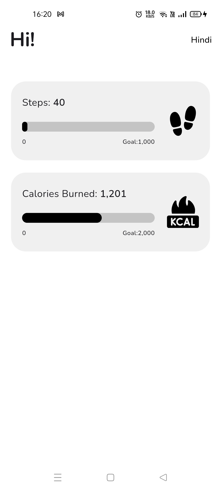
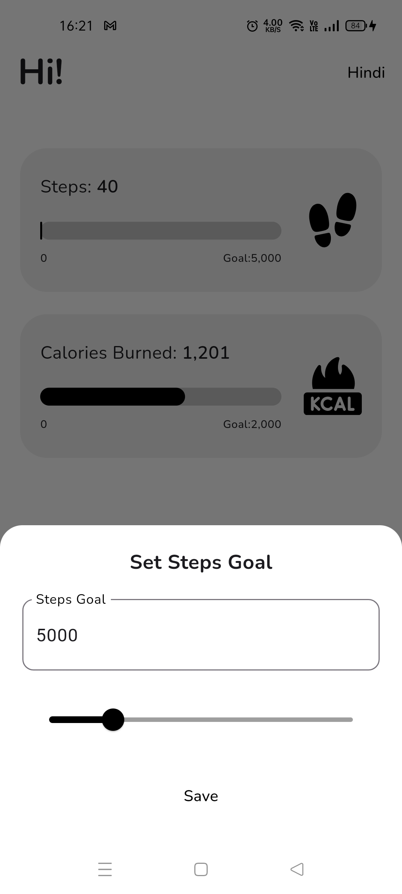
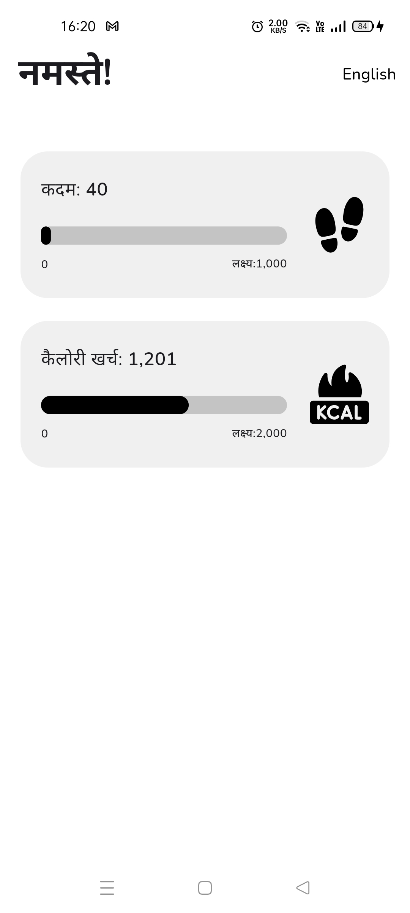

# Boozin Fitness App - Assignment Project Overview

## Project Description

- **Objective:** Develop a health and fitness application using Flutter.
- **State Management:** Utilize GetX for efficient state management.
- **Health Integration:** Integrate the Health package for fetching steps count and calories burnt, with Google Fit support.
- **Additional Features:** Added goal setting for steps and calories, support for English and Hindi languages, and CI/CD integration using GitHub Actions.
- **Persistence:** Save user preferences using Get Storage.

## Features Implemented

1. **Step Counter:** Track daily steps count using the Health package and Google Fit integration.
2. **Calories Burnt:** Monitor calories burnt throughout the day.
3. **Goal Setting:** Users can set and track daily goals for steps and calories.
4. **Multi-Language Support:** Available in both English and Hindi languages for broader accessibility.
5. **CI/CD Integration:** Implemented CI/CD pipeline using GitHub Actions for automatic generation of APK files.
6. **State Management:** Efficient state management using GetX for reactive updates and smooth user experience.

## Setup and Technologies Used

- **Framework:** Flutter
- **State Management:** GetX
- **Package Integration:** Health package, Get Storage
- **Localization:** Using GetX translations class
- **CLI:** Project setup and scaffolding done using Get CLI.

## Project Progress

The project successfully achieves its main objectives of tracking fitness metrics, setting goals, and providing a multilingual experience for users. State management with GetX ensures a smooth and responsive app interface, while integration with the Health package and Google Fit adds robust health tracking capabilities.

## Screenshots

_Figure 1: Home Screen in English._

_Figure 2: Goal Setting Screen_

_Figure 3: Home Screen in Hindi._

## Conclusion

The Boozin Fitness App serves as a comprehensive demonstration of Flutter development skills, including state management, package integration, and Google Fit integration for health tracking. Its additional features such as goal setting and multilingual support highlight creativity and problem-solving abilities in addressing user needs.
